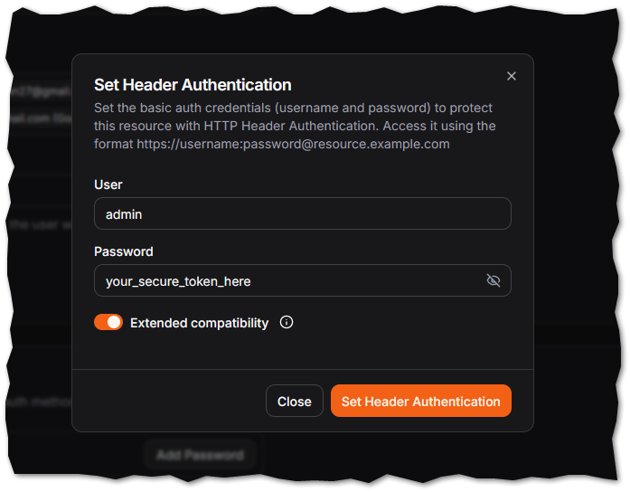
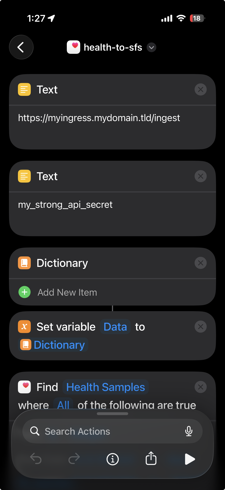
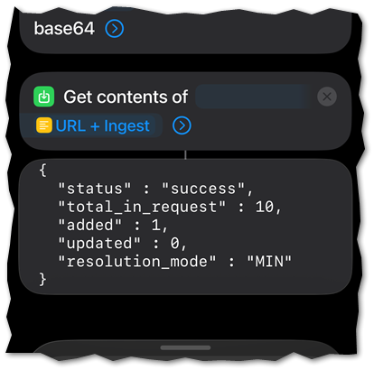
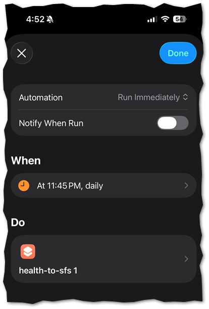

# 📋 health-to-sfs

> [!NOTE]
> This app was mostly vibe coded

A lightweight, containerized **FastAPI** ingest engine that your weight data to a local [Statistics for Strava](https://github.com/robiningelbrecht/statistics-for-strava) YAML configuration file.

> [!NOTE]
> This app is in no way affiliated with or part of the official Strava software suite, nor [Statistics for Strava](https://github.com/robiningelbrecht/statistics-for-strava)

## 🚀 Overview

This project provides a secure, internet-facing endpoint to receive weight payloads (e.g. Apple Shortcuts to "dump" health samples, or you to send data manually). It handles deduplication, data validation, and nested YAML updates while remaining invisible behind a Traefik reverse proxy.

The small [main.py](src/main.py) accepts an HTTP POST to the `/ingest` route, with a body like so:

```json
{
  "data": {
    "2026-03-31": "185.2",
    "2026-04-01": [
      "184.8",
      "186.1"
    ],
    "2026-04-02": "184.5",
    "2026-04-03": [
      "183.9",
      "184.2",
      "184.0"
    ]
  }
}
```

> [!NOTE]
> This app inserts the data as-is. Ensure you are sending data in your appropriate `UnitSystem` (kg vs lbs)

Data will be adjusted as per your `CONFLICT_RESOLUTION` environment variable as such:
  * `MIN` - Take the smallest value of the collection
  * `MAX` - Take the largest value of the collection
  * `AVG` - Calculate the mean value of the collection

The logic also requires Basic Authentication, combining the environment variables `AUTH_USER` and `API_SECRET` as the basic `username:password`

---

It is recommended to split out your weight yaml to a unique file:  [Splitting your configuration into multiple files](https://statistics-for-strava-docs.robiningelbrecht.be/#/configuration/main-configuration?id=splitting-your-configuration-into-multiple-files)

For example, you may have a unique `config-weight.yaml` set up as such:

```yaml
general:
  athlete:
    weightHistory:
      '2025-01-05': 83.4
      '2025-01-12': 82.9
      '2025-02-01': 82.1
```

---

## ⚙️ Setup & Installation

### 1. Environment Configuration
Create or update a .env file in the directory that you host statistics-for-strava, and add the following keys:

```sh
AUTH_USER: admin  #feel free to change
API_SECRET: my_secure_pw  #feel free to change
CONFIG_PATH: /config/config-weight.yaml  #consider breaking out your weight into a separate yaml
CONFLICT_RESOLUTION: MIN  #MIN, MAX, or AVG - What to do when multiple weights are found for the same day
OUTLIER_THRESHOLD: 0.15   #warning mechanism to warn if the data is this % (0-1) different than other values
```

### 2. Deployment
Add the health-to-sfs service to your existing `docker-compose` yaml.  Ensure you map the same `./config` volume to the new service:

```sh
...

services:
  app:
    image: robiningelbrecht/strava-statistics:v4.7.5
    container_name: statistics-for-strava
    restart: unless-stopped
    volumes:
      - ./config:/var/www/config/app    #LOCAL MOUNT NEEDS TO MATCH BELOW
...

  health-to-sfs:
    image: ghcr.io/steveredden/health-to-sfs:latest
    container_name: health-to-sfs
    restart: unless-stopped
    volumes:
      - ./config:/config                #LOCAL MOUNT NEEDS OT MATCH ABOVE
    env_file:
      - .env
    environment:
      AUTH_USER: ${AUTH_USER}
      API_SECRET: ${API_SECRET}
      CONFIG_PATH: "/config/config-athlete.yaml"
      CONFLICT_RESOLUTION: MIN
      OUTLIER_THRESHOLD: 0.15
    networks:
      - frontend
    ports:
      - 9005:8080
    healthcheck:
      test: ["CMD", "wget", "--no-verbose", "--tries=1", "--spider", "http://127.0.0.1:8080/health"]
      interval: 30s
      timeout: 5s
      retries: 3
      start_period: 10s
...
```

---

## Pangolin

Set up your Pangolin instance to allow basic auth, using the `AUTH_USER` and `API_SECRET` from your configuration



## Sending Data

As the project is just a web ingest engine, you can craft HTTP POST's as per the [Overview](#-overview) and send as often as you'd like.

---

### 📲 Apple Health Shortcut Integration

You can use an Apple Shortcut to automate the payload (and schedule) to be sent.  Firstly, you'll need an iPhone.  Secondly, you'll need a smart scale or application (e.g. Garmin) that writes to the Apple Health app.

Start with this shortcut (open it on your iPhone) to start retrieving health data from the Health app, and `POST` it to a URL:

https://www.icloud.com/shortcuts/7dde7305c41a4a1f90e1817e5d12f37f



This project, running as a container, opens a port and listens for new weight data...

It is recommended you test the shortcut and get valid responses, for example:



And finally, set up an automation to automically execute at a certain time of day:



---

### 📲 Android Integration

This will vary - more to come!
